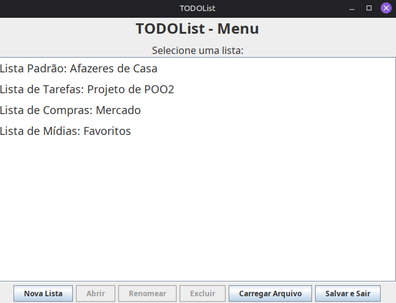
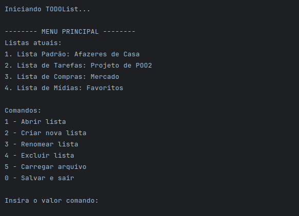

# TODOList - Java

## Sobre o Projeto
Este é um sistema de gerenciamento de tarefas e listas pessoais, desenvolvido em Java como um projeto acadêmico para a disciplina de Programação Orientada a Objetos 2. O objetivo principal era construir um sistema aplicando de forma correta e consistente os conceitos de POO, arquitetura de software e padrões de projeto (GoF).

O sistema permite o gerenciamento de múltiplos tipos de listas, cada uma com comportamentos específicos. O usuário pode criar listas de tarefas simples, listas com prazos, listas de compras com cálculo automático de preços e listas de mídias para avaliação.
A principal funcionalidade de negócio é a especialização dos itens: um item de "Compra" possui comportamento diferente de um item de "Mídia", mas ambos são tratados de forma polimórfica pelo sistema.
Todo o estado da aplicação (listas e seus itens) é salvo automaticamente em um arquivo binário `dados.ser` ao sair e recarregado ao iniciar.

## Funcionalidades Principais
* **Interface Dupla:** Execução em modo **Gráfico** ou **Textual** via configuração única.
* **Gerenciamento de Listas:**
    * Criação de listas com limite de capacidade (gerenciado via *Factory*).
    * Renomeação e exclusão de listas.
* **Tipos de Listas Especializadas:**
    * **Padrão:** Tarefas simples com status (Pendente/Feito).
    * **Tarefas (Metas):** Validação de datas para garantir que prazos sejam futuros.
    * **Compras:** Cálculo automático de valor total (Quantidade × Preço) e totalizador da lista.
    * **Mídias:** Registro de formato (físico/digital) e nota de avaliação (0-10).
* **Persistência de Dados:** Salvamento e carregamento automático do estado do sistema utilizando Serialização nativa do Java.

## Arquitetura e Conceitos Técnicos
O projeto foi estruturado para maximizar a Separação de Responsabilidades e o Baixo Acoplamento, utilizando o padrão MVC (Model-View-Controller) adaptado.

## Tipos de Interfaces
O sistema foi projetado para ser flexível, permitindo a interação através de dois modos distintos, configuráveis no código.

### 1. Interface Gráfica (Swing)
Uma interface visual completa construída com a biblioteca **Java Swing**. Oferece uma experiência de utilizador com janelas, botões e caixas de diálogo.
* **Características:** Utiliza `JFrame` para janelas, `JList` com renderização customizada para exibir detalhes dos itens e `JOptionPane` para entrada de dados.
* **Navegação:** Intuitiva através de cliques e menus visuais.

### 2. Interface Textual (Console)
Uma interface leve e eficiente baseada em linha de comandos (CLI). Ideal para ambientes sem suporte gráfico ou para execução rápida via terminal.
* **Características:** Menu baseado em loops de repetição, leitura robusta de entradas com `Scanner` e feedback textual direto.
* **Navegação:** Sistema de menus numerados (ex: "Digite 1 para Criar Lista").

### Diagrama de Classes (UML)
Abaixo está o diagrama que ilustra a estrutura do pacote `model`, detalhando as entidades principais, a hierarquia de herança dos itens e listas, e as suas relações com o gerenciador.

### Separação de Camadas
* **View (GUI ou Textual):** A camada de apresentação. Define como os dados são mostrados (ex: `ListaGraficaView` ou `ListaTextualView`). Ela não manipula os dados diretamente, apenas solicita ações ao gerenciador.
* **Controller (Gerenciador):** A "fachada" (Facade) do sistema. Centraliza todas as operações lógicas, delegando a criação de listas para a fábrica e a persistência para o módulo de IO.
* **Model:** As entidades (`Lista`, `Item` e subclasses). Contêm a lógica de dados, como validação de datas (`Utilidades`) e formatação de descrições.
* **Infraestrutura (GerenciadorIO):** Lida isoladamente com a leitura e escrita do arquivo de dados.

### O Padrão Abstract Factory
Para atender ao requisito de interface flexível (GUI ou Textual), foi usado o padrão **Abstract Factory**:
1.  A interface `IFabricaVisual` define o contrato para criar Menus e Visualizações de Listas.
2.  O `Main.java` utiliza a `FabricaVisualConcreta` para decidir, com base em uma *string* de configuração, se instancia a `ViewGraficaFactory` ou a `ViewTextualFactory`.
3.  O restante do sistema não sabe qual interface está rodando, garantindo desacoplamento total.

### Herança e Polimorfismo
* **Abstração:** A classe abstrata `Item` define o contrato base (título e estado). A classe abstrata `Lista` define as operações genéricas de coleção.
* **Herança:** As classes `ItemCompra`, `ItemMeta`, etc., estendem a base adicionando atributos específicos (preço, data limite).
* **Polimorfismo:** O sistema trata tudo como `Item` ou `Lista` na maior parte do tempo. O polimorfismo permite que a `ListaGraficaView` renderize um item de compra mostrando o preço e um item de meta mostrando a data, sem precisar de `if/else` complexos na lógica principal.

### Padrão Factory Method
A classe `FabricaDeListas` encapsula a lógica de criação das listas. Ela é responsável por instanciar a lista correta (`ListaPadrao`, `ListaMeta`, etc.) e impor regras de negócio, como o limite máximo de listas permitidas no gerenciador.

## Tecnologias e Dependências
* **Java SDK** (Compatível com versões modernas, desenvolvido em ambiente JDK 25).
* **Java Swing** (Biblioteca nativa para GUI).
* **Java Serialization API** (`java.io.Serializable` para persistência).

## Como Executar
1.  Abra a pasta do projeto na sua IDE (ex: IntelliJ IDEA ou Eclipse).
2.  **Para escolher a interface:**
    * Abra o arquivo: `src/Main.java`.
    * Localize a linha: `FabricaVisualConcreta.configurarInterface("Grafica");`
    * Mude a string para:
        * `"Grafica"` (para interface Swing).
        * `"Textual"` (para interface de console).
3.  Execute o projeto.
